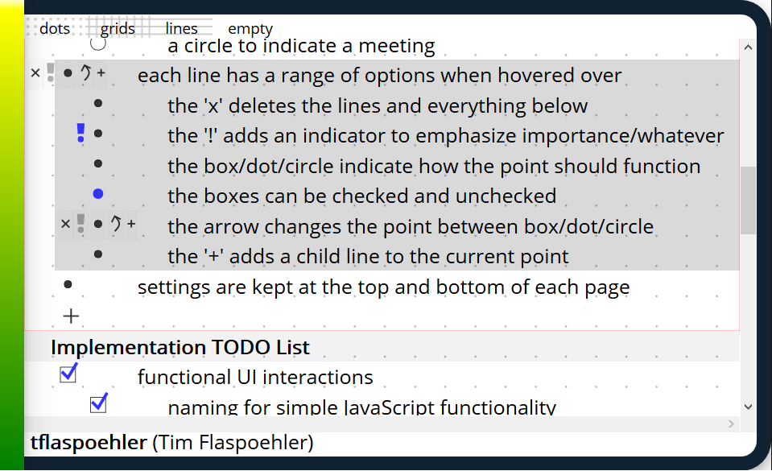

A project based on bullet journaling to document my work each day and save it in a database.

Many people keep personal/work notebooks to jot down notes throughout the day with little methodology for keeping it organized. Bullet journaling (bulletjournaling.com) is a simple method for keeping track of your daily life. For years, I used a very basic version of this so I thought I'd make a simple web app that follows my methodology. Below are the basics of what I used. I'm sure there are better versions of this out there (including through the main website), but this is simply what I use. At the end of the day, this is more of a project to keep up to date with building user-friendly, useful web apps. 
